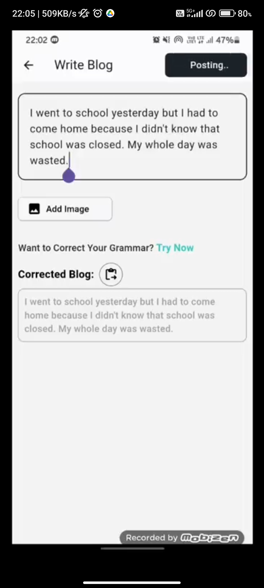

# Go_Social
## 🚀 Demo

You can download apk of this app and see some screenshots from below link: 
https://drive.google.com/drive/folders/1QpL_zNSuSxdkyxbx9XqmDSaapONsg1f0

A social media app project.
## Features: 
- Users can sign up with their email id and can sign in securely. for sign up otp verification will be done.
- Users can post a blog with a text and image that will be publicly visible.
- Users can use ai to correct their written blog grammatically.
- Users can like and dislike the blogs.
- users can chat with others privately.
- Users can add their profile picture.

## Backend:
- backend is live on AWS, used node.js, express.js and mongodb.
- proper authentication is performed while signing up and signing in the user.
